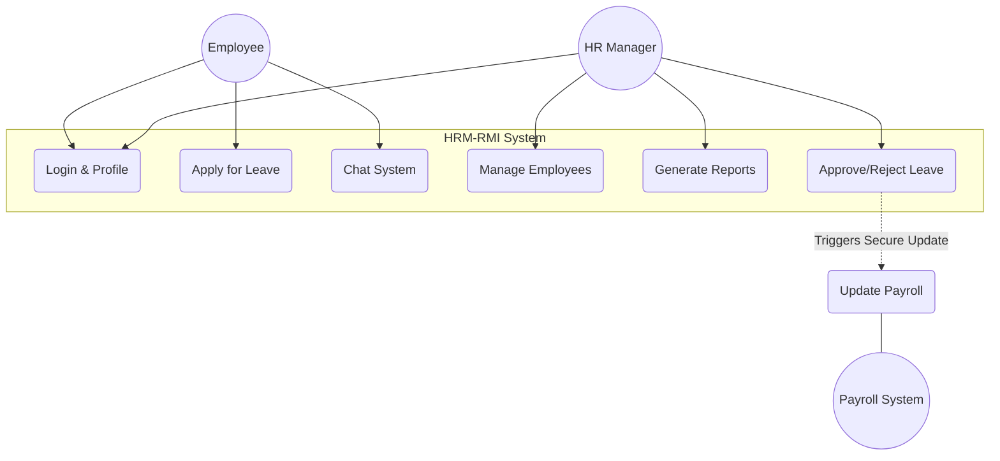
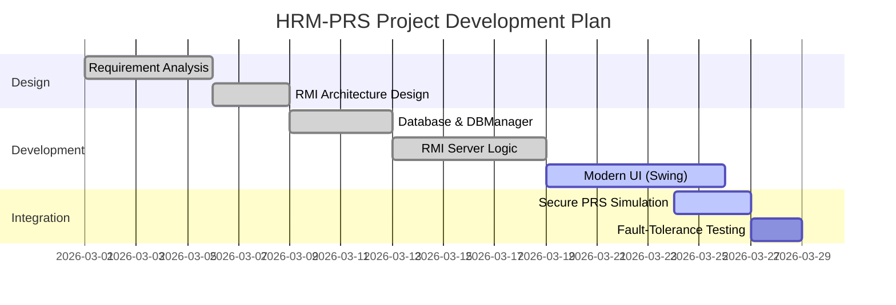

# HRM & PRS | Distributed System Project Analysis

This document provides the formal analysis and documentation for the development of the Distributed HRM application and its integration with the Payroll System (PRS).

---

## 1. Problem Statement & Background
The modern enterprise requires seamless synchronization between Human Resources (HR) and Payroll Systems (PRS) to handle employee workflows like leave approval and salary deduction. 

**Scenario:** A centralized system creates a bottleneck and single point of failure. The requirement is a distributed RMI-based system that allows HR and Employees to communicate, manage records, and trigger secure payroll updates across separate nodes.

## 2. Distributed System Core Roles
*   **Multi-threading:** Essential in the **HRM Server** to handle concurrent requests from multiple Employees and HR administrators simultaneously. Without it, one user browsing leave status would block all other users.
*   **Serialization:** Required to move `Employee`, `ChatMessage`, and `LeaveApplication` objects across the network. Serialization converts Java objects into byte streams for RMI transmission.
*   **Object-Oriented Programming (OOP):** Encapsulation and Inheritance (e.g., `UnicastRemoteObject`) allow for clean abstraction of remote services, making the distributed network feel like local method calls.

---

## 3. Secure PRS Communication (Step 3.4)
The implementation in `PayrollService.java` secures communication with the PRS via:
1.  **Authenticated Handshake:** A shared secret token (`PRS_AUTH_TOKEN`) is used to validate the connection before any data is exchanged between HRM and PRS.
2.  **Encrypted Payload:** Data such as Employee IDs and Deduction amounts are Base64 encoded and XOR-simulated to prevent "man-in-the-middle" sniffing during network transmission.
3.  **Automatic Persistence:** Every communication event is logged in a secure `payroll_history` database table for audit trails.

---

## 4. Use Case Model Diagram

---

## 5. Protocols in Distributed Systems
For this application, we recommend and use the following:
*   **TCP/IP:** For reliable, ordered delivery of chat messages and record updates.
*   **RMI (JRMP):** The Java Remote Method Protocol specifically designed for distributed Java objects.
*   **SSL/TLS:** Recommended for the transport layer to secure RMI stubs and skeletons in production environments.

---

## 6. Project Plan (Gantt Chart)

---

## 7. Cloud & Virtualization Recommendations
For future enhancement of the PRS system:
1.  **Infrastructure as Code (Terraform):** To automate the deployment of distributed nodes.
2.  **Docker Containers:** To encapsulate the HRM Server and PRS for heterogeneity (running on Windows, Linux, or macOS without local dependency issues).
3.  **AWS Lambda / Google Cloud Functions:** To handle payroll calculations as serverless "microservices" to further increase scalability and reduce cost.

---

## 8. Distributed vs. Centralized Systems
| Feature | Centralized | Distributed (Our System) |
| :--- | :--- | :--- |
| **Availability** | Low (Single Point of Failure) | High (Redundancy & Failover) |
| **Scalability** | Vertical (Limited/Expensive) | Horizontal (Add more nodes) |
| **Performance** | Performance degrades with users | Balanced load across servers |
| **Fault Tolerance**| None | High (RMI Registry handles lookup) |

---

## 9. Testing Manual (RMI Focus)
We use a combination of **Unit Testing** and **Integration Testing**:
1.  **Socket Connectivity:** Verify Port 12345 (Chat) and 1099 (RMI) are open and not blocked by firewalls.
2.  **Serialization Sanity:** Ensure `Employee` and `Leave` models correctly implement the `java.io.Serializable` interface.
3.  **Concurrency Testing:** Simulate two clients logging in at the same millisecond to verify `Thread Safety` in the `synchronized` RMI methods.
4.  **Database Failover State:** Intentionally stop MySQL and verify that the application displays a user-friendly error message rather than crashing.
